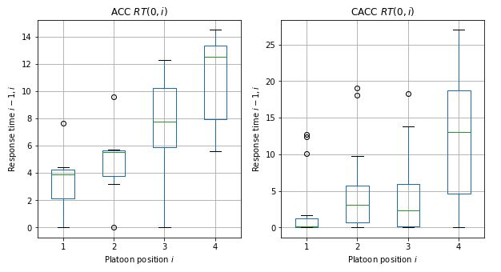

# Vehicle time response reliability on vehicle automation
## Evidence from experimental driving modes in platooning conditions

| **CARMA Analysis:** |  |
| :------------------ | :----------------------------------------------------------------------------------------------------------------------------------: |
| **PoC Analysis:**   |    |

###  Launch simulations 

*  Launch simulations   [here](https://mybinder.org/v2/gh/aladinoster/vrt_analysis/master?filepath=TF-AnalysisResponseTime.ipynb)

**Individual profile speeds**

**Response time distributions**

